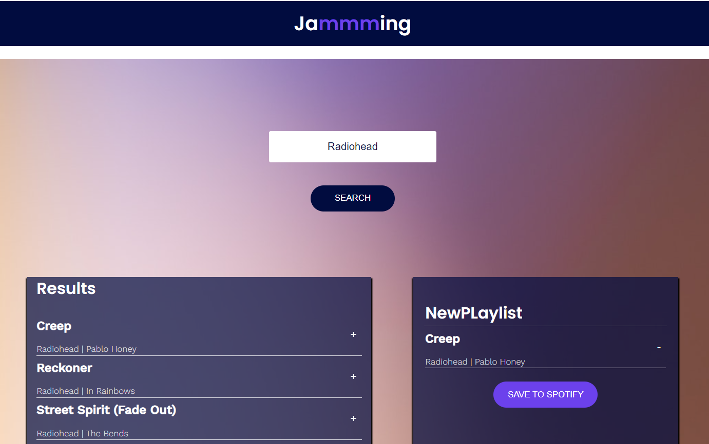

# Jamming

Jamming is a responsive React web app that uses the Spotify API to:
- search for music tracks
- create a playlist and save them to a Spotify's user account 
- display the user's playlists

This project was built for the [Create a front-end app with React Skill Path](https://www.codecademy.com/learn/paths/build-web-apps-with-react)

[Live Website](https://kb-jamming.surge.sh/)



This project was bootstrapped with [Create React App](https://github.com/facebook/create-react-app).

## Deployment

Clone this repo: 

```
git clone git@github.com:kristinabog/kb-jamming.git
```
```
cd kb-jamming
```
```
run npm install
```

Deployment:

Run the following in the CLI
```
npm install --global surge
```
```
npm run build
```
```
cd build
```
```
cp index.html 200.html
```
```
surge
```
Type in chosen name for URL and you are done.


## Credits

All copyright for the code and design to [Codecademy](https://www.codecademy.com/)

[Background image](https://www.pexels.com/photo/blurry-image-of-a-brownish-background-1242348/)

